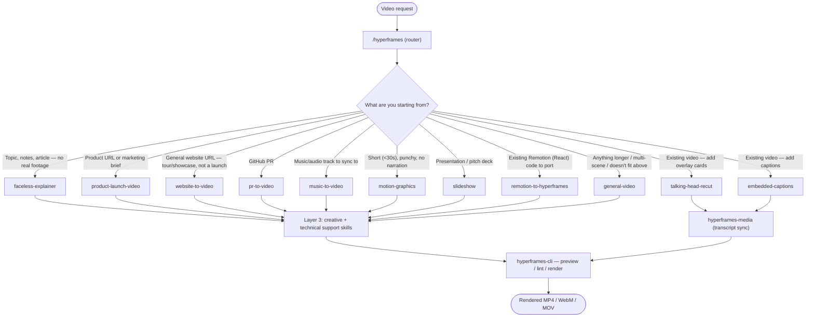

# HyperFrames Skills — Reference

Local skill pack for authoring HyperFrames video compositions (HTML → rendered MP4/WebM/MOV), installed via `npx skills add heygen-com/hyperframes`. Lives at `.agents/skills/` in the repo root. This is a **separate tool from `heygen-pipeline/`** — HyperFrames authors standalone HTML compositions you can edit/diff/commit locally; `heygen-pipeline/` is the Python batch-render path for finalized `.txt` scripts. See `CLAUDE.md`'s Tool Routing section for how Synthesia/HeyGen web UI/heygen-pipeline/HyperFrames relate.

21 skills total, in 5 layers. You'll almost always start at the top layer and let it hand off — you rarely need to invoke layers 3–5 by name yourself.

## 1. Always start here

**`hyperframes`** — the router. Read it first for any "make/edit/animate/render a video" request. It reads your input and picks the right workflow from Layer 2 below. If you're not sure which skill you need, this is the one to invoke — don't guess.

## 2. Decision flow — which creation workflow?

**Disambiguation notes** (these overlap on the surface — pick by intent, not just input type):
- Product URL + wants to **market/launch** it → `product-launch-video`, even though it's also "a website." A general site tour with no launch intent → `website-to-video`.
- `slideshow` only if the user explicitly says presentation/pitch deck/slide deck — otherwise confirm before assuming it.
- `remotion-to-hyperframes` **only** on an explicit port/convert/migrate request. Remotion mentioned in passing, or "same video as my Remotion one" → treat as a fresh build (`general-video` or the workflow that fits the content).
- `general-video` is the fallback — reach for it when nothing above clearly fits, or the piece is long/multi-scene (brand reels, montages, title cards).

## 3–5. Full reference table

| Layer | Skill | What it does | Use when | Don't use when |
|---|---|---|---|---|
| 1 · Router | **hyperframes** | Reads your request and routes to the right workflow below. | Any video/animation/render request — first stop, always. | You already know the exact downstream skill and want to skip straight there. |
| 2 · Creation | **faceless-explainer** | Text/topic → explainer video; every visual is invented (typography, diagrams, abstract graphics), up to ~3 min. | Concept breakdowns, how-tos, listicles, narrative explainers with no real footage. | Product promo, real website tour, GitHub PR, or existing footage — those have dedicated skills. |
| 2 · Creation | **product-launch-video** | Product/marketing URL, script, or brief → launch/promo video. | Marketing, launching, or revealing a product, SaaS, app, or company. | General non-product site tours (→ website-to-video). |
| 2 · Creation | **website-to-video** | Headless-Chrome capture of a site → tour/showcase/social clip. | Portfolio, blog, or landing-page showcase with no launch angle. | Product launches (→ product-launch-video, even from a URL). |
| 2 · Creation | **pr-to-video** | Reads a GitHub PR via `gh` CLI → code-change explainer, up to ~3 min. | Changelog, feature reveal, fix, or refactor walkthrough from a real PR/diff. | Topic explainers with no actual PR (→ faceless-explainer). |
| 2 · Creation | **music-to-video** | One audio analysis pass drives frame layout on the beat grid. | You have a music/audio track (or a video to pull audio from) and want it beat-synced. | No audio track supplied. |
| 2 · Creation | **motion-graphics** | Short, design-led motion: kinetic type, stat count-ups, chart hits, logo stings, lower-thirds. | Under ~10–30s, no narration arc, no live-action subject. | Longer/narrated/multi-scene pieces (→ general-video) or brand reels. |
| 2 · Creation | **slideshow** | Presentation composition: slides, fragment reveals, branching, hotspot nav. | Explicit ask for a presentation/pitch deck/slide deck. | Ambiguous "deck-like" request — confirm intent first. |
| 2 · Creation | **remotion-to-hyperframes** | Ports an existing Remotion (React) composition to HyperFrames HTML; flags unsupported patterns (useState/useEffect/async metadata/3rd-party libs/`@remotion/lambda`). | Explicit port/convert/migrate request from a real Remotion source. | Passing Remotion mentions, non-Remotion sources (After Effects, Framer Motion) — those go through general-video instead. |
| 2 · Creation | **general-video** | Fallback workflow for any length/format: multi-scene pieces, brand/sizzle reels, montages, title cards, static loops. | Nothing above clearly fits, or the piece is long/multi-scene. | A specialized workflow above clearly matches — prefer that. |
| 2 · Existing video | **talking-head-recut** | Layers timed graphic-overlay cards (titles, lower-thirds, callouts, PiP) onto a video that plays in full, synced to transcript. | "Package/dress up my video," add on-screen graphics to existing footage. | Plain subtitles with no overlay design (→ embedded-captions). |
| 2 · Existing video | **embedded-captions** | Adds captions via 32 visual identities — either composited-into-scene (`column-flow`) or themed constitutions (e.g. `anchor`, `neonsign`, `terminal`). | "Add captions/subtitles" to an existing talking-head clip. Default identity is `anchor` (quiet, verbatim) — don't over-animate unless asked. | Adding non-caption graphic overlays (→ talking-head-recut). |
| 4 · Asset import | **figma** | Imports Figma assets, brand tokens, components, or Motion animations/shaders into a composition. | User pastes a figma.com link or wants Figma brand/design brought into a video. | No Figma source involved. |
| 4 · Asset import | **media-use** | Agent Media OS: one `resolve` verb turns any BGM/SFX/image/icon need into a frozen local file + ledger entry (project cache → global cache → HeyGen catalog → freeze/register). | Any composition needs music, sound effects, images, or icons — called automatically by hyperframes-media and creation workflows. | Rarely called directly by name. |
| 3 · Support | **hyperframes-core** | The composition contract: HTML structure, `data-*` timing attributes, `class="clip"`, tracks, sub-compositions, variables, deterministic-render rules. | Read before writing composition HTML by hand; otherwise invoked automatically. | — |
| 3 · Support | **hyperframes-creative** | Non-animation creative direction: design specs (frame.md/design.md), palettes, typography, narration, beat planning, brand/style calls. | Deciding look-and-feel, narration, or creative direction. | Motion mechanics (→ hyperframes-animation). |
| 3 · Support | **hyperframes-animation** | Motion rules, multi-phase scene blueprints, transitions, and 7 runtime adapters (GSAP default, Lottie, Three.js, Anime.js, CSS keyframes, WAAPI, TypeGPU). | Any motion/animation task, or runtime-specific animation API lookups. | Broad creative/brand decisions (→ hyperframes-creative). |
| 3 · Support | **hyperframes-keyframes** | Seek-safe 2D/3D keyframes, GSAP timelines, FLIP, SVG morph/draw, text trails, 3D depth. | Fine-grained keyframe/timeline work. | Broad scene strategy or brand design. |
| 3 · Support | **hyperframes-media** | Shared audio engine: multi-provider TTS, BGM/SFX, Whisper transcription, background removal, caption authoring. | Voiceover, music, SFX, transcripts, or caption text — called automatically by most creation workflows. | — |
| 3 · Support | **hyperframes-registry** | Installs/wires registry blocks and components (`hyperframes add`), and scaffolds new ones for upstream contribution. | Adding a prebuilt block/component, or authoring one to contribute back. | — |
| 5 · Build/render | **hyperframes-cli** | The dev loop: `init`, `add`, `catalog`, `capture`, `lint`, `validate`, `preview`, `render`, `publish`, `lambda` (cloud render), `doctor`, etc. | Running any `npx hyperframes ...` command, or troubleshooting the render environment — this is the final step of every workflow above. | — |

## How it fits together

A typical run: **hyperframes** (router) → one Layer-2 creation workflow → that workflow pulls in Layer 3/4 support skills as needed (creative direction, motion, media, assets) → **hyperframes-cli** to preview/lint/render → output file. You'll rarely invoke Layers 3–5 directly; they're pulled in automatically by whichever Layer-2 skill you're running.
